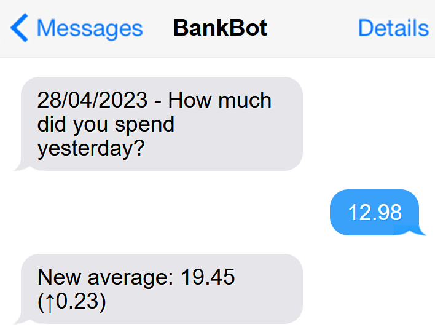

# Telegram Budgeter

This is a project to run on a server or Raspberry Pi which sends me a Telegram message every day asking how much I spent the day before. The idea is to keep track of average daily spending.



## Requirements

For Google Sheets integration, many python modules are available ([gspread], [gsheets], [pygsheets], [EZSheets]). I use [gspread] as it seems up-to-date, and has a good range of [examples](https://docs.gspread.org/en/latest/user-guide.html).

| Requirement | Version |
| ----------- | ------- |
| Python      | 3.11.1  |

[gspread]: https://pypi.org/project/gspread/
[gsheets]: https://pypi.org/project/gsheets/
[pygsheets]: https://pypi.org/project/pygsheets/
[EZSheets]: https://pypi.org/project/EZSheets/

## Commands

### Set up environment

```bash
python3 -m venv env
```

### Install dependencies

```bash
pip install -r requirements.txt
```

### Test

```bash
pytest
ptw # Run with watch
```

## Google Credentials

Credentials are stored in `google_credentials.json`. Follow the [gspread "Service Account" guide][gspread-guide] to set up a service account and download the credentials JSON file.

```json
{
  "type": "service_account",
  "project_id": "telegram-budgeter",
  "private_key_id": "[PRIVATE KEY ID]",
  "private_key": "[PRIVATE KEY]",
  "client_email": "...@....gserviceaccount.com",
  "client_id": "[CLIENT ID]",
  ...
}
```

[gspread-guide]: https://docs.gspread.org/en/latest/oauth2.html#for-bots-using-service-account

## Telegram Credentials

To obtain an access token for telegram, see [help page](https://github.com/python-telegram-bot/python-telegram-bot/wiki/Introduction-to-the-API), but in essence, talk to the [BotFather](https://t.me/botfather).

The access token is used via an environment variable, or a `.env` file, which is not tracked by git.

```bash
touch .env
```

```.env
TELEGRAM_BOT_ACCESS_TOKEN=...
```
